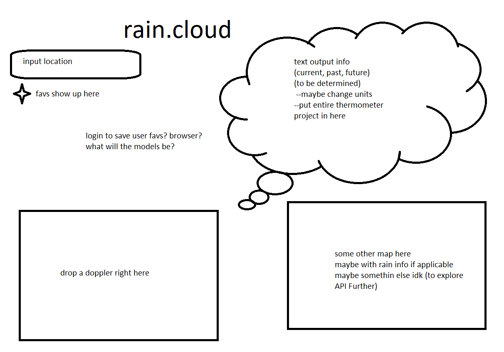

# rain.cloud

---

## API

* AccuWeather API

## tech

* expresslayouts
* dotenv
* is that what you mean?

## MVP

* select location
* display cloud map
* display alt info
* display weather
* save favorite locations

## stretch goals

* add all maps
* add temp conversion
* cute it up
* cute it up based on weather condition selection

### roadblocks

* API piping
* styling placements
* not forgetting everything over the weekend(staying on task)
* who knows im sure something lovely will happen